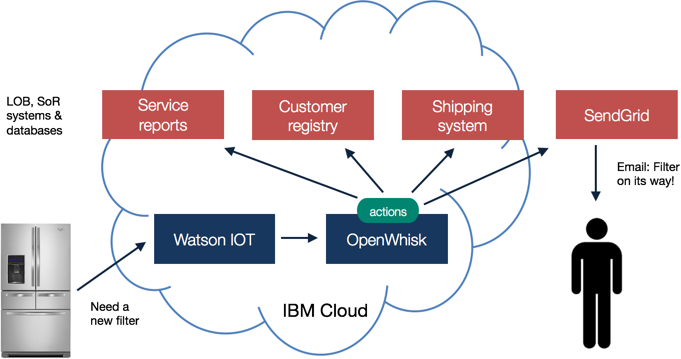
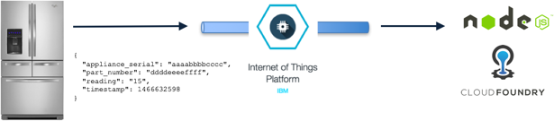
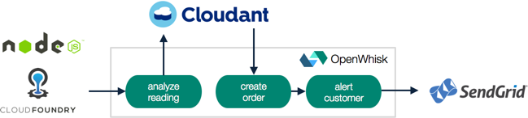

*Read this in other languages: [中国](README-cn.md), [português](README-pt.md).*

[](https://travis-ci.org/IBM/ibm-cloud-functions-serverless-iot-openfridge)

# Proactive customer service with Apache OpenWhisk on IBM Cloud Functions and the Watson IoT Platform

This project demonstrates [serverless technology](https://developer.ibm.com/opentech/2016/09/06/what-makes-serverless-attractive/) - powered by [Apache OpenWhisk on IBM Cloud Functions](https://bluemix.net/openwhisk/) - in a smarter home scenario where appliances send diagnostic readings to the cloud for analysis and proactive maintenance.

The application integrates the Watson IoT Platform, OpenWhisk, and IBM Code services in an event-driven use case driven by those status messages from Internet-connected appliances.

This highlights the serverless programming model and discusses the benefits of this approach relative to traditional cloud development for handling IoT workloads. For more background, check out [the developer story](https://developer.ibm.com/code/journey/power-smart-fridge/) on IBM Code.

You should have a basic understanding of the OpenWhisk programming model. If not, [try the action, trigger, and rule demo first](https://github.com/IBM/openwhisk-action-trigger-rule). You'll also need a IBM Code account and the latest [OpenWhisk command line tool (`wsk`) installed and on your PATH](https://github.com/IBM/openwhisk-action-trigger-rule/blob/master/docs/OPENWHISK.md).

If you're just interested in the **[OpenWhisk package for Watson IoT MQTT](https://github.com/krook/openwhisk-package-mqtt-watson)** integration, you can find that in its own package repository.

[](https://www.youtube.com/watch?v=0Sl4rWZYo8w)


## Components
- Watson IoT Platform on IBM Code
- Apache OpenWhisk on IBM Cloud Functions
- Cloudant NoSQL Service on IBM Code
- SendGrid Email Service on IBM Code

## Improving customer service with IoT device driven analytics

The Internet of Things enables manufacturers and their customers to make more efficient use of hardware devices by attaching them to a network. Software running on a device can be paired with analytics in the cloud to improve the quality of customer service and lower the cost of maintenance for consumer and manufacturer alike.

In this use case an appliance manufacturer proactively manages diagnostic events from machines in a customer's home. A network-connected refrigerator can report that it needs a part serviced (such as a water filter in need of replacement because its filter life reading is low). These message events can trigger analytics logic to send alerts (such as that a replacement part was automatically ordered because the customer was still within the covered warranty period).

Event-driven computing based on a serverless architecture is a compelling programming model for IoT because it offers the following key benefits to the developer:

- **Automatic scale** – A primary benefit of event-driven computing is not having to predict demand for deployed services, which is particularly important as the number devices added to the Internet continues to outnumber humans. The number of instances of an application (written as a single function) scales up or down automatically in response to the current workload, in this case, readings from refrigerators.

- **Reduced cost** – The event-driven cost model enables developers to pay only for the time that business logic is actually running. Contrast this with the need to pay for applications or servers that are pre-provisioned in anticipation of peak demand and that are always on - even when not responding to customer requests - in a PaaS or IaaS model.

- **Speed to market** – Serverless programming enables rapid development and enforces modularity and flexibility resulting in faster application delivery because the developer focuses more on creating applications and less on their operational concerns.

- **Simplified maintenance** – The deployment unit of the serverless programming model is a single function. These functions can be updated independently, and assembled or orchestrated using mappings declared as triggers and rules.

The diagram below shows how a solution built on the Watson IoT platform and OpenWhisk can enable this connected home use case and provide the benefits of a serverless architecture.



## Primary workflow

A refrigerator periodically sends diagnostic readings to a cloud service indicating the status of its parts. It might send these only when certain threshold is breached (using edge analytics) or allow a cloud service to determine a normal range for all readings it receives (cloud analytics).

```json
{
    "appliance_serial": "aaaabbbbcccc",
    "part_number": "ddddeeeeffff",
    "reading": "15",
    "timestamp": 1466632598
}
```

* [This JSON message](docs/sample-messages.txt) is sent by the device to an MQTT topic - such as `iot-2/evt/refrigerator-simulator/fmt/json` - on the Watson IoT Platform on IBM Code. Devices can also send arbitrary binary formats to improve performance.

* A Node.js Cloud Foundry application that is subscribed to an wildcard event topic event for refrigerator devices - such as `iot-2/type/+/id/+/evt/+/fmt/json` - triggers OpenWhisk actions when new messages are received. (This reuses code from the [James Thomas' OpenWhisk and MQTT tutorial](http://jamesthom.as/blog/2016/06/15/openwhisk-and-mqtt/)).

    

* [An analytics action](actions/analyze-service-event.js) is triggered by the message event from the Cloud Foundry app, and it inspects the message, determining whether to take further action. If, for example, the filter life reading is lower than normal, it creates a new service record in a Cloudant database.

* [Another action](actions/create-order-event.js) is triggered by the service record creation to insert an order record. It queries the service record, and maps the appliance to its registered owner to evaluate whether the customer is still under warranty. If the appliance is still covered, it automatically creates an approved order for the part. If not, it creates a pending order that requires customer approval and payment.

* [A notification action](actions/alert-customer-event.js) is triggered by the new order record. If the appliance was in warranty, the action sends an email notifying the user that the part has been ordered and shipped. Otherwise, it sends an email asking the owner to complete the purchase of the out-of-warranty part.

    

## Supplementary workflows

* [An action](actions/alert-customer-event.js) is triggered on a schedule every night to look for pending warranty expirations (such as within the next 30 days) and send an alert to customers suggesting that they purchase a new support plan before they lose coverage.

* The [same action](actions/alert-customer-event.js) can be used on demand to alert the customer each time an order state changes in the database (such as progressing from _ordered_ to _shipped_ to _delivered_).

    

## Bringing it all together

These workflows come together to demonstrate an end-to-end scenario that can improve customer service with OpenWhisk, IBM Code, and Watson services.


## Running the sample application

1. [Set up the IBM Code services (Cloudant, SendGrid, Watson IoT, and a Cloud Foundry app)](docs/BLUEMIX.md).
2. [Set up the OpenWhisk actions, triggers, and rules](docs/OPENWHISK.md).

# Learn more

* **Artificial Intelligence Patterns:** Enjoyed this Pattern? Check out our other [AI Patterns](https://developer.ibm.com/code/technologies/artificial-intelligence/).
* **Data Analytics Patterns:** Enjoyed this Pattern? Check out our other [Data Analytics Patterns](https://developer.ibm.com/code/technologies/data-science/)
* **AI and Data Pattern Playlist:** Bookmark our [playlist](https://www.youtube.com/playlist?list=PLzUbsvIyrNfknNewObx5N7uGZ5FKH0Fde) with all of our Pattern videos
* **With Watson:** Want to take your Watson app to the next level? Looking to utilize Watson Brand assets? [Join the With Watson program](https://www.ibm.com/watson/with-watson/) to leverage exclusive brand, marketing, and tech resources to amplify and accelerate your Watson embedded commercial solution.
* **Data Science Experience:** Master the art of data science with IBM's [Data Science Experience](https://datascience.ibm.com/)
* **PowerAI:** Get started or get scaling, faster, with a software distribution for machine learning running on the Enterprise Platform for AI: [IBM Power Systems](https://www.ibm.com/ms-en/marketplace/deep-learning-platform)
* **Spark on IBM Cloud:** Need a Spark cluster? Create up to 30 Spark executors on IBM Cloud with our [Spark service](https://console.bluemix.net/catalog/services/apache-spark)
* **Kubernetes on IBM Cloud:** Deliver your apps with the combined the power of [Kubernetes and Docker on IBM Cloud](https://www.ibm.com/cloud-computing/bluemix/containers)

# License
This code pattern is licensed under the Apache Software License, Version 2. Separate third party code objects invoked within this code pattern are licensed by their respective providers pursuant to their own separate licenses. Contributions are subject to the Developer [Certificate of Origin, Version 1.1 (“DCO”)] (https://developercertificate.org/) and the [Apache Software License, Version 2]( (http://www.apache.org/licenses/LICENSE-2.0.txt).

ASL FAQ link: http://www.apache.org/foundation/license-faq.html#WhatDoesItMEAN
