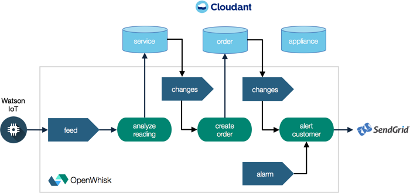

# Set up OpenWhisk actions, triggers, and rules

If you haven't already, download, install, and test the [`wsk` CLI tool](https://new-console.ng.bluemix.net/openwhisk/cli).

From this point forward, you can instead just run the following commands to set up the OpenWhisk resources with a deployment script:

- Make sure `local.env` is complete. Run `./deploy.sh --env` to see if all necessary variables are set.
- Create the actions, trigger, rules, and package bindings with `./deploy.sh --install`
- If you run into any issues installing run `./deploy.sh --uninstall` to start with a fresh environment.

Otherwise, read on if you want to understand how all the OpenWhisk actions, triggers, and rules come together or if you want to set them up yourself.



## Create feed action to handle the trigger

In this step we'll bind a feed action to that Cloud Foundry proxy app which listens for new MQTT messages from Watson IoT.

### Set a persistent variable for the feed consumer HTTP endpoint

- Change to the root of this repository and run `source local.env`
- Create the feed package:

  ```bash
  package create \
    --param provider_endpoint "http://$CF_PROXY_HOST.mybluemix.net/mqtt" \
    mqtt
  ```

### Create a feed action trigger that binds the feed provider proxy to OpenWhisk

- Create the feed action:

  ```bash
  wsk action create --annotation feed true mqtt/mqtt-feed-action actions/mqtt-feed-action.js
  ```

## Create custom actions

Inside of the core OpenWhisk logic, we have the trigger we created above for the MQTT feed from the refrigerator via Watson IoT, along with 3 other triggers: Two are bound to changes in Cloudant databases, and one is bound to a nightly alarm. Both of these trigger types are built into the Bluemix OpenWhisk platform.

### Create the custom actions

- Create the message analysis action:

  ```bash
  wsk action create analyze-service-event actions/analyze-service-event.js \
    --param CLOUDANT_USERNAME "$CLOUDANT_USERNAME" \
    --param CLOUDANT_PASSWORD "$CLOUDANT_PASSWORD"
  ```

- Create the order entry action:

  ```bash
  wsk action create create-order-event actions/create-order-event.js \
    --param CLOUDANT_USERNAME "$CLOUDANT_USERNAME" \
    --param CLOUDANT_PASSWORD "$CLOUDANT_PASSWORD"
  ```

- Create the warranty check action:

  ```bash
  wsk action create check-warranty-renewal actions/check-warranty-renewal.js \
    --param CLOUDANT_USERNAME "$CLOUDANT_USERNAME" \
    --param CLOUDANT_PASSWORD "$CLOUDANT_PASSWORD"
  ```

- Create the customer alert action:

  ```bash
  wsk action create alert-customer-event actions/alert-customer-event.js \
    --param CLOUDANT_USERNAME "$CLOUDANT_USERNAME" \
    --param CLOUDANT_PASSWORD "$CLOUDANT_PASSWORD" \
    --param SENDGRID_API_KEY "$SENDGRID_API_KEY" \
    --param SENDGRID_FROM_ADDRESS "$SENDGRID_FROM_ADDRESS"
  ```

- Create the Cloudant driven actions:

  ```bash
  wsk action create service-sequence \
    --sequence /_/$CLOUDANT_INSTANCE/read,create-order-event
  wsk action create order-sequence \
    --sequence /_/$CLOUDANT_INSTANCE/read,alert-customer-event
  ```

### Test the actions

- Out of warranty November 30, 2016

  ```bash
  wsk action invoke --blocking --result analyze-service-event \
  --param body '{"appliance_serial": "xxxxyyyyzzzz", "part_number": "ddddeeeeffff", "reading": 15, "timestamp": 1484197200}'
  ```

- In warranty till January 31, 2017

  ```bash
  wsk action invoke --blocking --result analyze-service-event \
  --param body '{"appliance_serial": "aaaabbbbcccc", "part_number": "ddddeeeeffff", "reading": 14, "timestamp": 1484197200}'
  ```

- Check whether any appliance is nearing warranty expiration:

  ```bash
  wsk action invoke --blocking --result check-warranty-renewal
  ```

- Alert the customer:

  ```bash
  wsk action invoke --blocking --result alert-customer-event \
  --param appliance '{"_id": "aaaabbbbcccc", "serial": "aaaabbbbcccc", "warranty_expiration": 1485838800, "owner_name": "Daniel Krook", "owner_email": "krook@example.com", "owner_phone": "18885551212"}'
  ```

## Create custom triggers and rules

- Create the trigger for the feed action:

  ```bash
  wsk trigger create openfridge-feed-trigger \
    --feed mqtt/mqtt-feed-action \
    --param topic "$WATSON_TOPIC" \
    --param url "ssl://$WATSON_TEAM_ID.messaging.internetofthings.ibmcloud.com:8883" \
    --param username "$WATSON_USERNAME" \
    --param password "$WATSON_PASSWORD" \
    --param client "$WATSON_CLIENT"
  ```

- Create the triggers for the Cloudant feeds:

  ```bash
  wsk package bind /whisk.system/cloudant "$CLOUDANT_INSTANCE" \
    --param username "$CLOUDANT_USERNAME" \
    --param password "$CLOUDANT_PASSWORD" \
    --param host "$CLOUDANT_USERNAME.cloudant.com"
  wsk trigger create service-trigger \
    --feed "$CLOUDANT_INSTANCE"/changes \
    --param dbname "$CLOUDANT_SERVICE_DATABASE"
  wsk trigger create order-trigger \
    --feed "$CLOUDANT_INSTANCE"/changes \
    --param dbname "$CLOUDANT_ORDER_DATABASE"
  ```

- Create the trigger for the periodic warranty check:

  ```bash
  wsk trigger create check-warranty-trigger \
    --feed /whisk.system/alarms/alarm \
    --param cron "$ALARM_CRON" \
    --param maxTriggers 10
  ```

- Create the rules:

  ```bash
  wsk rule create service-rule service-trigger service-sequence
  wsk rule create order-rule order-trigger order-sequence
  wsk rule create check-warranty-rule check-warranty-trigger check-warranty-renewal
  wsk rule create openfridge-feed-rule openfridge-feed-trigger analyze-service-event
  ```

# End-to-end test

In order to test the entire solution end-to-end, send a sample MQTT event using the Paho client (as outlined in [BLUEMIX.md](BLUEMIX.md)), and observe an email sent to the address registered with the device.

## Troubleshooting

For troubleshooting, use `cf logs openfridge` (with the optional `--recent` flag) to see logs of the feed provider app, and OpenWhisk dashboard for logs and status of the various triggers and actions.
