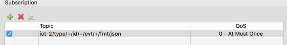
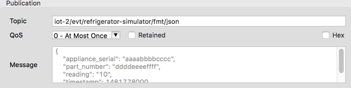
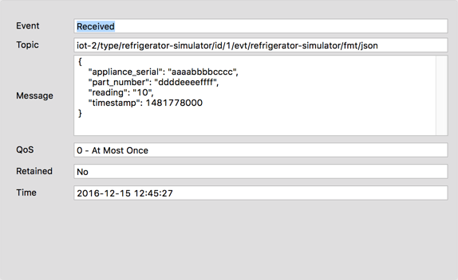

### Install Paho for your workstation and add devices

- Download [Eclipse Paho](http://www.eclipse.org/paho/clients/tool/) for your computer type, then open it and create a new Connection.
- You'll need to know the `WATSON_TEAM_ID` (which you should also set in `local.env`). This is the six character alphanumeric ID that you'll see in the top right corner of the Watson IoT dashboard you used earlier.
- Set the "Server URI" to `tcp://$WATSON_TEAM_ID.messaging.internetofthings.ibmcloud.com:1883` (replacing `$WATSON_TEAM_ID` with your six digit ID).
- Set the "Client ID" to `d:$WATSON_TEAM_ID:refrigerator-simulator:$DEVICE_1_ID` (replacing `$DEVICE_1_ID` with the value you set in the previous section. This value doesn't have to be added to `local.env`).
- On the Options tab, check the `Enable login` box, set the `Username` to `use-token-auth` and enter the token for the specific device in the `Password` field.
- Optionally, create an additional two device connections following the previous steps.
- Finally, create a message consuming application connection using the same steps as for the devices, except for the `Client ID` which will be `a:$WATSON_TEAM_ID:openfridge`, and your "Username" and "Password" which will be your API Key information from the previous section (key and token). Update the `WATSON_USERNAME`, `WATSON_PASSWORD` and `WATSON_CLIENT` in `local.env` accordingly.

### Connect to IoT Platform and post a message

- First, let's subscribe the consuming application connection to receive messages from all devices. Add a "Subscription" to the `iot-2/type/+/id/+/evt/+/fmt/json` topic and Subscribe (you may have to click `Connect` and Subscribe again if you lose the connection). Note that this queue format is different from the ones the devices post to because it contains wildcards. Update the topic in `local.env` file to match. 

- From the device simulators, then publish a test message onto the Device Type topic. You can find [sample messages for 3 devices here](sample-messages.txt).

- Enter the "Topic" as `iot-2/evt/refrigerator-simulator/fmt/json` in the "Publication" area.

- Enter the sample JSON, making sure the Serial matches your Device.

  ```json
  {
    "appliance_serial": "aaaabbbbcccc",
    "part_number": "ddddeeeeffff",
    "reading": "15",
    "timestamp": 1466632598
  }
  ```

  

- Look back at the `History` tab for the application, and you should see the message has been received. 
